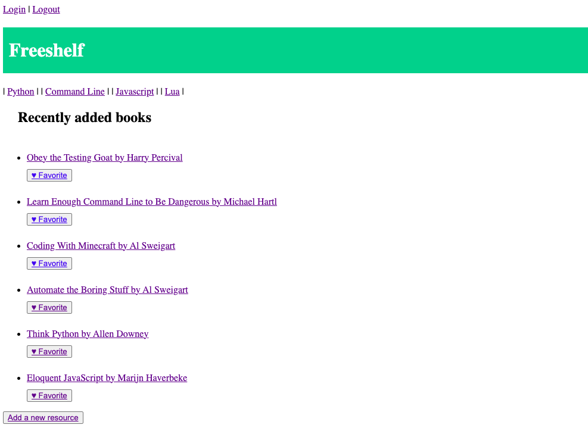
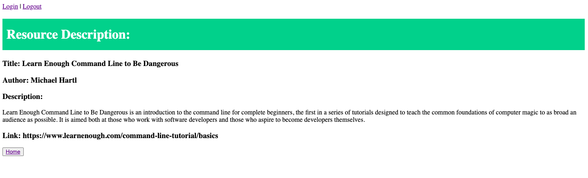
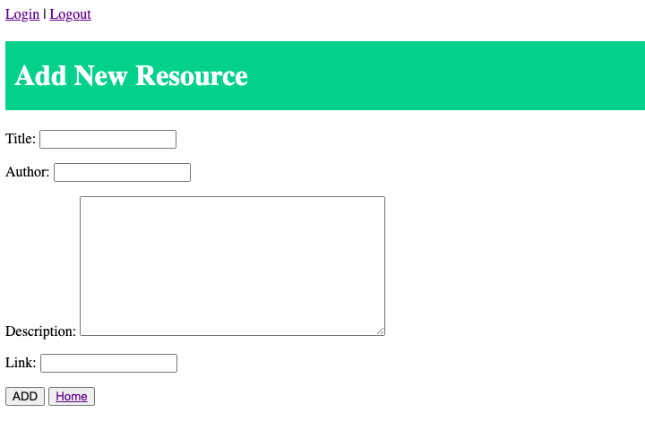

## Freeshelf

Django application to collect an index of free programming resources (books, articles, blogs, zines, and podcasts) online.

- list of all the resources added
- register and log in
- favorite resources

